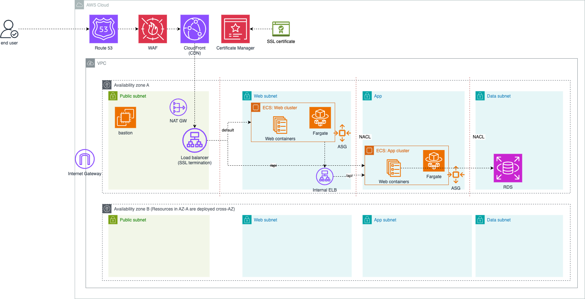

# Question 1: Design a 3-tier web app architecture

## Architecture:

  
1. Web Tier:  
   - Use an Elastic Load Balancer to handle a variable amount of traffic.
   - Use CloudFront to reduce latency.  
   - SSL termination can be handled at the Load Balancer.  
   
2. Application Logic Tier:  
   - Auto-adjust capacity with ASG to handle an increase in user requests.  
   - Secure db connection with isolated network VPC, private subnets and NACLs
   
3. Database Tier:  
   - RDS for SQL and DynamoDB for No-SQL  
   - Use multi-AZ deployments to sync data to a standby instance in a different AZ.  
   - For backup and recovery, use automated backups and enable point-in-time recovery. Use AWS backup.
   
Trade-offs:
- Using CloudFront incurs costs, but improves the user experience.  
- Multi-AZ deployments increase costs, but improve data durability and availability.  
