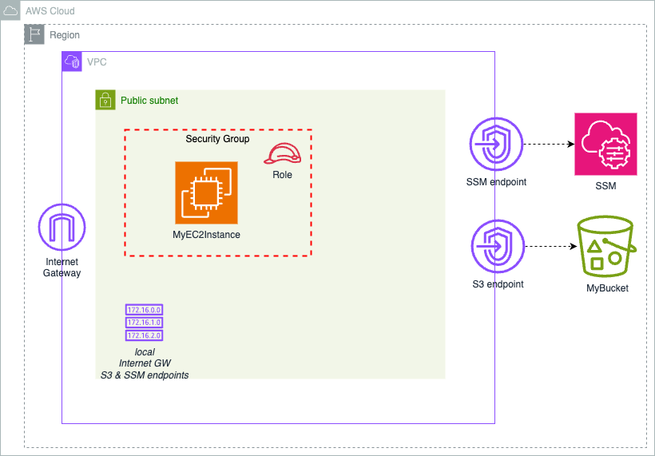

# Question 2: Debug and Improve CloudFormation Template

* Improvements:
- Added EC2 resources to VPC
- Enable S3 bucket encryption
- Limit SSH access to a CIDR range
- Use SSM session manager to access EC2 instances, instead of ssh.
- Avoid hard-coded values, use CloudFormation parameters.
- Use Elastic IP to ensure IP doesn't change
- Restrict public access to the S3 bucket
- SG ports types should be integers, not string.
- Use VPC endpoint to access S3 and SSM

## Architecture: Q2 - Improved CFN template
